# 1.学生管理系统

## 1.1  需求分析

- 添加学生及成绩信息
- 将学生信息保存到文件中
- 修改和删除学生信息
- 查询学生信息
- 根据学生成绩进行排序
- 统计学生的总分

## 1.2  系统设计

- ### 1.2.1  学生管理系统分为7大功能模块：如下

  - 学生信息模块
  - 查找学生信息模块
  - 删除学生信息模块
  - 修改学生信息模块
  - 学生成绩排名模块
  - 统计学生总人数模块
  - 显示全部学生信息模块

 

 - ### 1.2.1  系统业务流程

   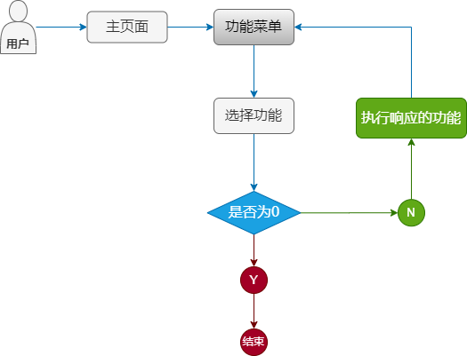
   
 - ### 1.2.2 系统开发环境
    - 操作系统: Windows 10;
    - Python版本：Python3.7；
    - 开发工具：VS-code
    - Python内置模块：os、re

  - ### 1.2.3 文件夹结构
    - 学生信息管理系统的文件夹结构比较简单,结构图如下:
     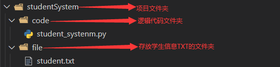

## 1.3 实现主函数
- 运行学生信息管理系统首先需要进入菜单悬着的界面,在这个列出程序中的所有功能，学生信息管理系统功能表如下:

| 编号 | 功能 |
| ---- | ----| 
|0|退出系统
|1|录入学生信息,调用insert()函数
|2|查找学生信息,调用search函数
|3|删除学生信息,调用delete()函数
|4|修改学生信息,调用modify()函数
|5|排序功能,调用sort()函数
|6|统计人数功能,调用total()函数
|7|显示所有学生信息,调用show()函数
---
#### 1.3.1业务流程
  
---
学生信息管理系统的主函数,主要同于实现系统的主页面,在main()函数中调用menu()函数生成功能选择菜单,并且应用if语句去控制各个子函数的调用,最终可以实现学生信息的录入、查询、显示、修改等功能，图如下：
  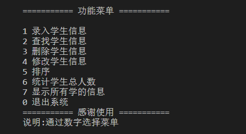

# 2.学生信息维护
学生信息维护用于维护学生信息。主要包括于一下三个功能：
- ### 录入学生信息
- ### 修改学生信息
- ### 删除学生信息

##  功能介绍
- ### 2.1 录入学生信息功能：
  - #### 2.1.1 功能概述：
    录入学生信息功能主要就是获取用户在控制台输入的信息，并且把它们保存到文件中，然后达到永久保存的目的。
  - #### 2.1.2 代码实现如图：
    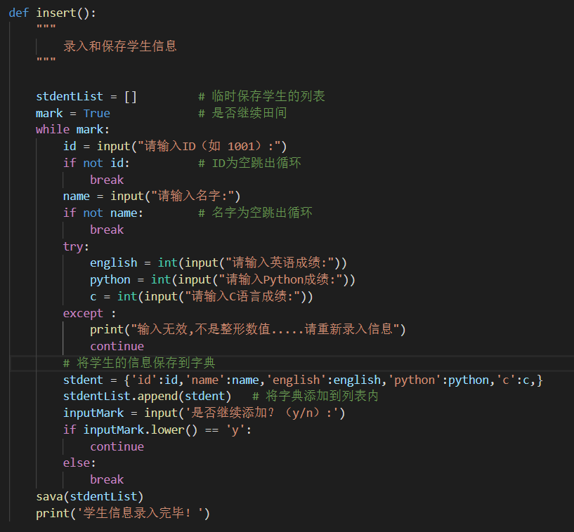

  - #### 2.1.3 录入学生信息流程：
    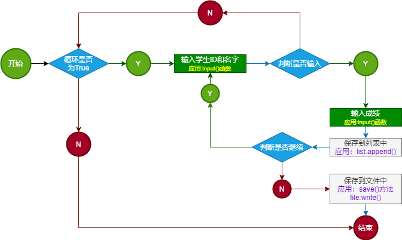
  
---
- ### 2.2 保存学生信息功能：
    - #### 2.2.1 功能概述：
      编写一个向文件中写入指定内容的函数,将此函数命名为save().
    - #### 2.2.2 代码实现如图：
      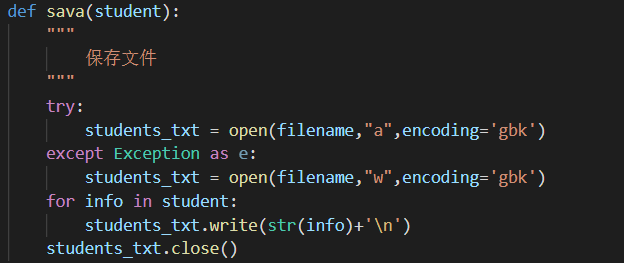

---
- ### 2.3 删除学生信息功能：
  - #### 2.3.1 功能概述：
    删除学生信息功能主要就是用户在控制台输入学生的ID，到文件中找到对应的学生信息，并将其删除
  - #### 2.3.2 业务流程：
    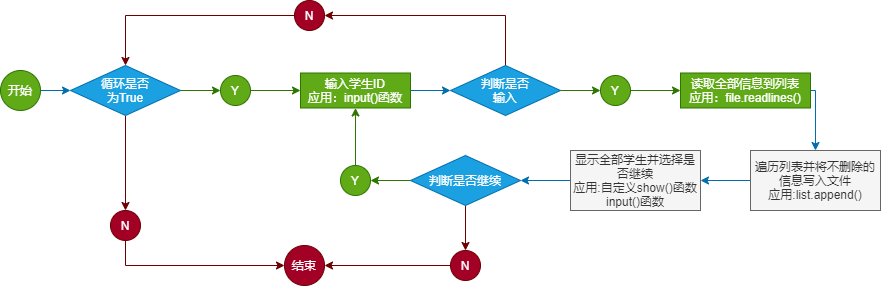

  - #### 2.3.3 代码实现如图:
    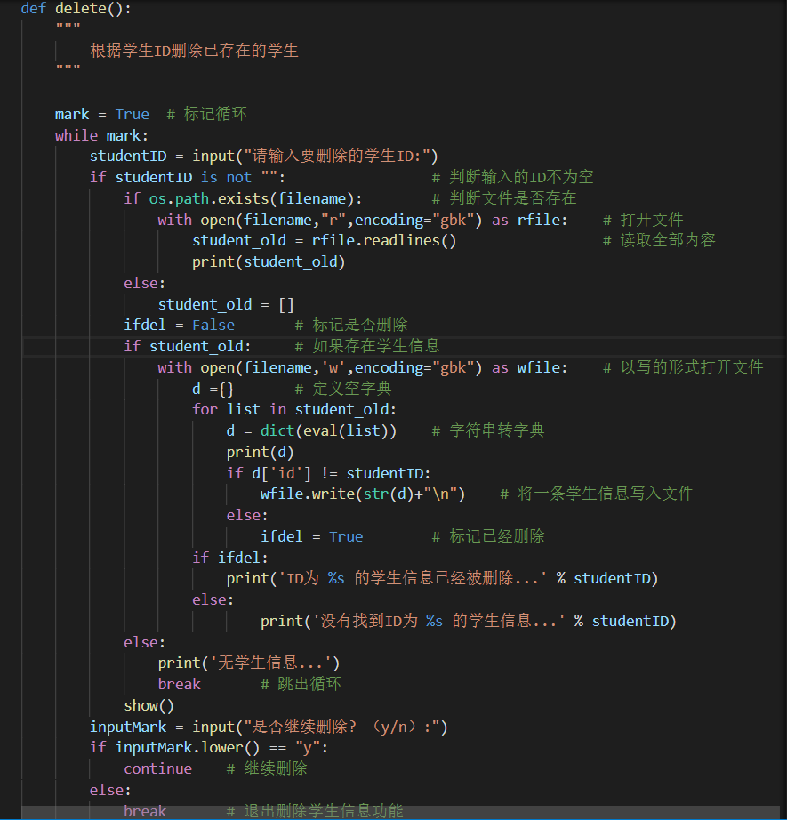
---
- ### 2.4 修改学生信息功能：
  - #### 2.3.1 功能概述：
    修改学生信息功能主要就是根据用户在控制台输入学生的ID，从文件中找到对应的学生信息，在对其进行修改。
  - #### 2.3.2 业务流程：
    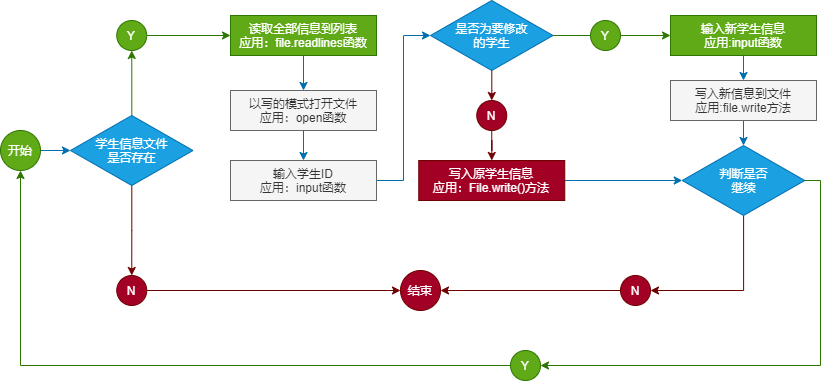

  - #### 2.3.3 代码实现如图:
    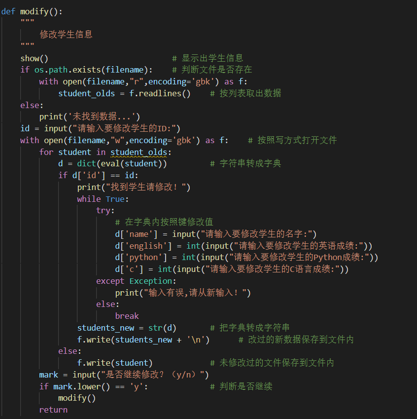
---

- # 3.查询/统计模块设计
 - 查询/统计模块用于查询喝统计学生信息,主要包括于以下三个功能:
    - 根据学生编号或姓名查找学生信息
    - 统计学生总认识
    - 显示所有学生信息

- ### 3.1 显示所有学生信息功能：
  - #### 2.3.1 功能概述：
    显示所有学生信息功能主要就是将保存到文件中的学生信息进行获取并显示到控制台
  - #### 2.3.2 业务流程：
    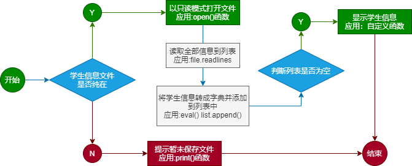

  - #### 2.3.3 代码实现如图:
    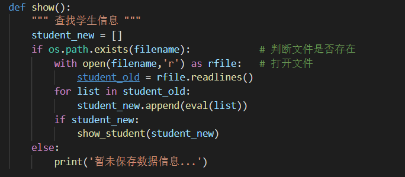
- ### 3.2 指定格式输出
    - 功能概述：  
      此函数用于按指定格式显示获取对方传过来的参树，只能接收列表。

    - 代码实现图如下：
      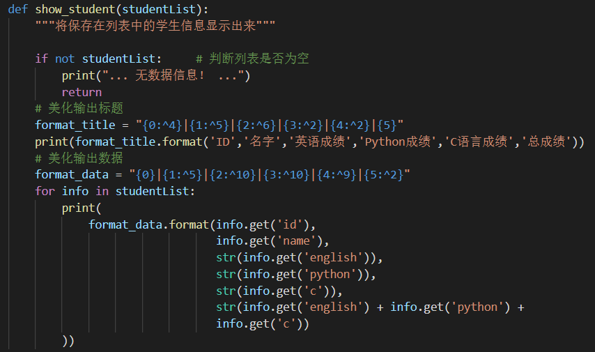
---
- ### 3.3 查找学生信息功能
  - #### 2.3.1 功能概述：
    查找学生信息功能主要是根据用户在控制台输入的学生ID或姓名，再到文件中找到对应的学生信息s在通过显示学生信息
  - #### 2.3.2 业务流程：
    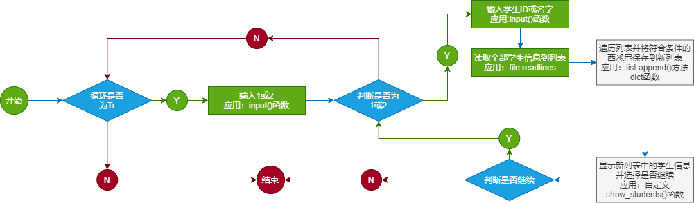

  - #### 2.3.3 代码实现如图:
    
---
- ### 3.4 统计学生总人数功能
  - #### 2.3.1 功能概述：
    统计学生总人数功能主要用于统计学生信息文件中的学生信息个数，并在控制台显示
  - #### 2.3.2 业务流程：
    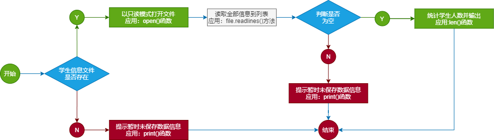

  - #### 2.3.3 代码实现如图:
    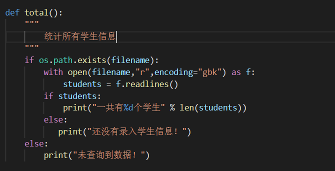
---
# 4.排序模块设计
- 排序模块用于对学生信息按成绩进行排序，主要通过学科成绩或总成绩按照升序或者降序排序。
 
- ### 4.1 排序功能
  - #### 4.1.1 功能概述：
    排序功能主要对学生信息按英语成绩、Python成绩、C语言成绩或总成绩升序或降序进行排序
  - #### 4.1.2 业务流程：
    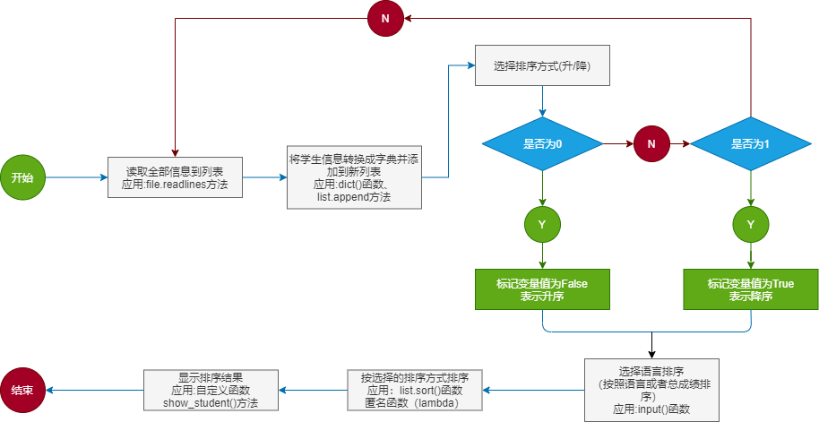

  - #### 4.1.3 代码实现如图:
    

# 小结
主要使用Python语言开发了一个学生信息管理系统，项目核心是对文件、列表和字典进行操作，其中，对文件进行操作时用来永久保存学生信息；而将学生信息以字典的形式储存到列表中，是为了方便对学生信息的查找、修改和删除。